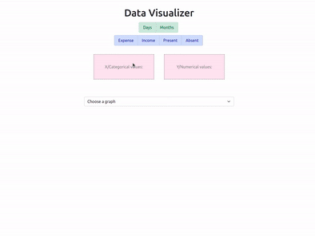

# Data Visualizer

Create charts(pie and line) by dragging and dropping the dataset.

## Implementation

- Drag and drop implemented using 'Drag and Drop API' (https://www.w3schools.com/html/html5_draganddrop.asp) 
- Charts ~ `react-chartjs-2`
- Styling ~ `react-bootstrap`

## Demo

